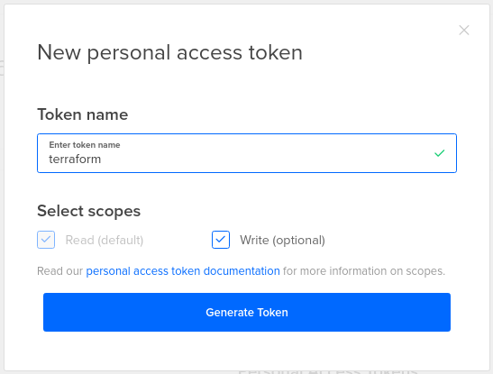

# Download Terraform and other dependencies

- Download terraform https://www.terraform.io/downloads.html ([terraform_1.0.9_linux_amd64.zip](https://releases.hashicorp.com/terraform/1.0.9/terraform_1.0.9_linux_amd64.zip)) and make sure its the `PATH`

- Install git, openssh-client, curl, jq

```apt-get install git openssh-client curl jq```

- If you want, t

# Digital Ocean setup

## 1) Create a digitalocean account

https://www.digitalocean.com/

## 2) Generate an API key and set the `DIGITALOCEAN_TOKEN` in your `.bashrc`

Once logged in, go to API -> Token/Keys:


Give it a name then click Generate Token:



Keep it somewhere safe and put it in your `.bashrc`:

```export DIGITALOCEAN_TOKEN="CHANGEME"```

Then reload your bashrc:

```. .bashrc```

## 3) Generate an ssh key

```ssh-keygen -f ~/.ssh/id_rsa_terraform```

## 4) Add your public key to Digital Ocean

Once logged in, go to Settings -> Security:


Add the content of the public key (`~/.ssh/id_rsa_terraform.pub`), then click Add SSH Key:


Follow the next step to add your key fingerprint so your public key is pushed whne you deploy a droplet.

## 5) Adjust the `DIGITAL OCEAN` section in `global.tf`

- Set the `do_ssh_keys` variable (a comma separated list of ssh key fingerprints) : ```curl -s -X GET -H "Content-Type: application/json" -H "Authorization: Bearer ${DIGITALOCEAN_TOKEN}" "https://api.digitalocean.com/v2/account/keys" | jq```
- You can adjust the default size and the region of the droplets; 1cpu 1gb should be enough
- Make sure you retest everything if you change the default image

## 6) Load the key in `ssh-agent`

Add you key to the ssh agent: ```ssh-add ~/.ssh/id_rsa_terraform```

You can list the loaded keys with: `ssh-add -l`

# Next steps

You can now deploy a jumpbox
